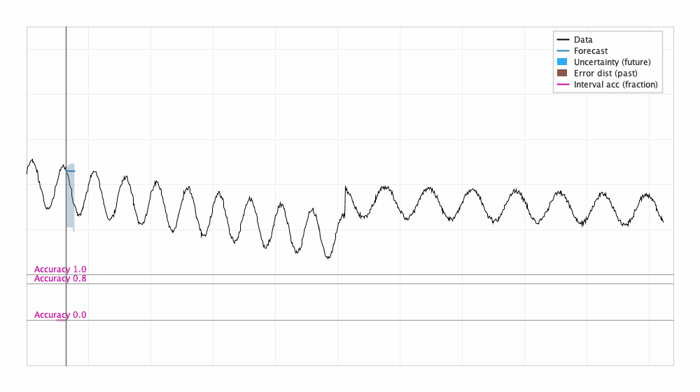
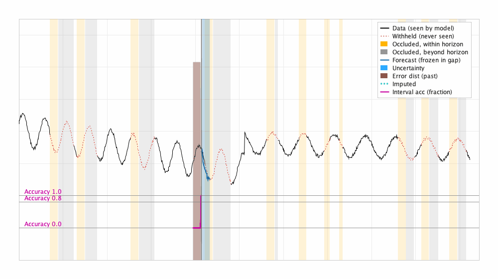
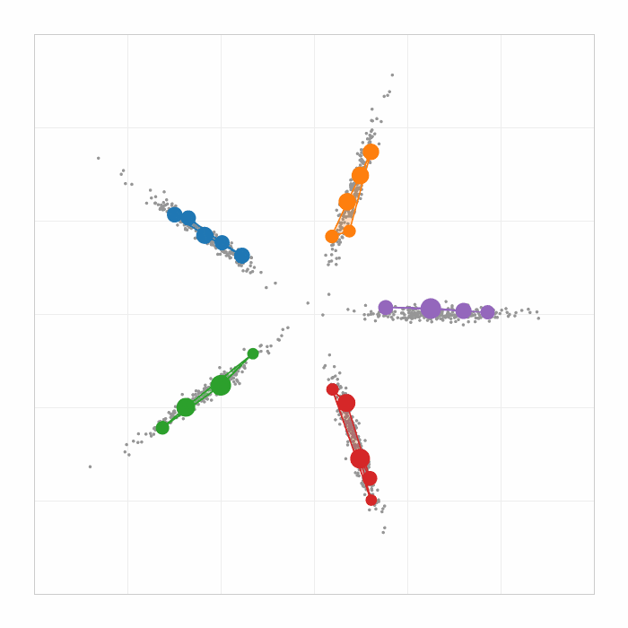

# Random Cut Forest

[](https://github.com/streamingalgorithms/randomcutforest/actions/workflows/maven.yml)
[](https://github.com/streamingalgorithms/randomcutforest/actions/workflows/rust.yml)
[](https://central.sonatype.com/namespace/org.streamingalgorithms)
[](LICENSE)

**A sketch of an evolving data stream.**

Random Cut Forest (RCF) is a probabilistic data structure that maintains a
summary of a stream in one pass. It was originally conceived for anomaly detection. But a summary of a stream can 
answer questions much broader than a specific scoring method. The same forest can answer questions about multiple quantities, such as density, nearest
neighbors, missing values, and forecasting. Since the data structure continues to maintain itself, 
one gets automatic, dynamic estimators of these quantities. This library provides a framework that 
allows one to define other dynamic estimators and inference algorithms. For example, see the forecasting example in Figure 1 below.

<p align="center">
  
</p>

<p align="center">
  <em>Figure 1. <code>RCFCaster</code> Forecasting a stream -- the algorithm self-adapts. <br>
  Produced by <a href="Java/examples/src/main/java/org/streamingalgorithms/randomcutforest/examples/RCFCastExample.java">RCFCastExample</a>; see <a href="#reading-that-forecast">Reading that forecast</a>.</em>
</p>

Periodicity
is contextual and the (local) periodicity itself changes in Figure 1. GappedRCFCastExample below, in Figure 2, shows the same example when
segments of the original input (corresponding to vertical yellow and grey stripes indicating occlusion) are never fed to the algorithm, which is about 40% of the input. The input seen by the algorithm 
is tessalated and the algorithm stops predicting if the occluded gap exceeds the horizon. Note that a separate step to impute the missing data will lead to reconciliation issues with the drift. 

<p align="center">
  
</p>
<p align="center">
  <em> Figure 2. <code>GappedRCFCaster</code> The stream imputes the missing data segments (vertical stripes) on the fly.  <br>
  Produced by <a href="Java/examples/src/main/java/org/streamingalgorithms/randomcutforest/examples/GappedRCFCastExample.java">GappedRCFCastExample</a>
</p>

Note that RCFs are naturally multidimensional, and while the examples above plot 1 dimension even though the predictions were 
performed in the code for both. Multidimensional forecasting is fascinating in its connection to 
<a href=https://en.wikipedia.org/wiki/Granger_causality>Grainger Causality</a> -- but note that a streaming algorithm typically does not make 
any assumptions about stationarity and hence the algorithm can adapt.

One can have dynamic multidimensional inference such as (multi-centroid) clustering such as in Figure 3, using the same machinary. 

<p align="center">
  
</p>
<p align="center">
  <em> Figure 3. <code>DynamicSummarization</code> The time decay is set high to expire the previously input points. <br>
  Produced by <a href="Java/examples/src/main/java/org/streamingalgorithms/randomcutforest/examples/summarization/Summarization.java">Summarization</a>
</p>
---

## The connection to random forests

Historically decisions trees employed complicated partitioning rule in <a href=https://en.wikipedia.org/wiki/Decision_tree_learning>Classification and Regression Trees (CART)</a>, chosen to
separate the training data optimally with a simpler inference rule. There has been
continued effort in determination of partitioning rules, icluding small space projections as in <a href=https://en.wikipedia.org/wiki/Random_forest>Random Forests</a>. Randomization has been 
seen as a vehicle for generalization and stochastic (batch) discrimination. But most such analyis would require the trees 
to be rebuilt -- or have a deliberate discrepancy between stated construction and use.

RCF inverts the thinking -- the partitioning is simple **(recursive) random cuts**: pick a dimension with
probability proportional to its extent, pick a split point uniformly. The goal is to preserve arbitrary
but natural (for example distances) properties over a collection of trees -- drawing upon online algorithms that 
it is easier to solve optimization problem if the underlying graph is a tree. RCF shows that the specific 
recursive partitioning can be maintained under insertion *and deletion* using stochastic coupling over the 
time dependent (streaming) input. A collection of such trees is a provable embedding of distances. This makes 
continuous learning over a stream of unknown length possible provided the sketch 
can be decoded at inference time -- and if the decoding can be averaged across models then we can use 
algorithms for trees. 

Complicated data pipelines are eliminated.
The best piece of data is that which does not have to be collected!

- **The sketch is reusable.** One forest, many scoring functions -- multimodality 
   of inference, which also implies efficiency because quantities only need to 
   be computed if they are required for the specific analysis trajectory. We do not need 
    to over optimize at build time and throughput is an easy guarantee. 
- **The arrow of time is preserved.** Adaptive re-sampling and batch rebuilds
  break causality; the future influences the past. RCF's sampler doesn't violate 
  the arrow of time.

Anomaly detection is usually the *beginning* of an
investigation, not the end. A single bit saying "anomalous" is rarely actionable.
The interesting follow-ups — *which dimensions mattered? what should the value
have been? did the local density move?* — are all questions about the normal, and
a structure that vends scores of unusuality should be able to describe usual (though 
not necessarily by the same action or algorithm). 


For more, please consider:

| | |
| --- | --- |
| [**Random Cut Forests**](https://opensearch.org/blog/random-cut-forests/) | The design tenet, RCFs as sketches, and why simple cuts plus rich inference beats the alternative. Start here. |
| [**Streaming analytics**](https://opensearch.org/blog/streaming-analytics/) | What you build on top: thresholding, grades, forecasting, and the practicalities of a stream that never stops. |
| [**One million entities in one minute**](https://opensearch.org/blog/one-million-enitities-in-one-minute/) | What it costs at scale. |
| [Guha, Mishra, Roy, Schrijvers, ICML 2016](https://proceedings.mlr.press/v48/guha16.pdf) | The paper. |

---

## Quick start

Requires **JDK 21 or later**.

```xml
<dependency>
  <groupId>org.streamingalgorithms</groupId>
  <artifactId>randomcutforest-parkservices</artifactId>
  <version>5.0.0</version>
</dependency>
```

```groovy
implementation 'org.streamingalgorithms:randomcutforest-parkservices:5.0.0'
```

`parkservices` pulls in `randomcutforest-core` transitively. Take
`randomcutforest-core` alone if you want raw scores and intend to do your own
thresholding.

> **Vector API.** The core uses the incubating `jdk.incubator.vector` module.
> Add `--add-modules jdk.incubator.vector` to your JVM arguments, or the runtime
> will refuse to load the module. This is an incubator module and may move
> between JDK releases.

### Detect anomalies

`ThresholdedRandomCutForest` turns raw scores into a graded determination, so you
are not left calibrating a threshold by hand.

```java
int baseDimensions = 3;   // your actual variables
int shingleSize = 8;      // how much context defines "normal here"

ThresholdedRandomCutForest forest = ThresholdedRandomCutForest.builder()
        .dimensions(baseDimensions * shingleSize)   // note: the product
        .shingleSize(shingleSize)
        .internalShinglingEnabled(true)
        .anomalyRate(0.01)
        .build();

for (double[] point : stream) {
    AnomalyDescriptor result = forest.process(point, timestamp);
    if (result.getAnomalyGrade() > 0) {
        System.out.printf("t=%d grade=%.2f expected=%s%n",
                result.getInternalTimeStamp(),
                result.getAnomalyGrade(),
                Arrays.toString(result.getExpectedValuesList()[0]));
    }
}
```

Note alongside the grade, one gets the *expected* value, the relative
attribution across dimensions, and the start of the deviation began. Note that it may be impossible to detect expectation immediately -- suppose a shop has either a low volume week or a high volume week. If we see a high monday sales and a low tuesday sales -- we detected an anomalous pattern. But was monday the issue or tuesday? These pieces of information such as relative start time, expected values, etc., allow 
one to initiate a root-cause process — it comes from the same trees that made the judgement about anomaly/otherwise. It is possible that a powerful algorithm/agent reverse engineers an algorithm and explains it, but would
it not be easier if the algorithm willingly provided information: "here is what the decision was based on"? In fact such information immediately makes it feasible to use decades old 
predictor-corrector paradigms. Existing ThresholdedRandomCutForest employs such a predictor-corrector paradigm and more than 
one specific score in its corrector step to suppress anomalies.

### Forecast

`RCFCaster` extrapolates over a horizon and, more usefully, tells you how much to
trust it. Intervals are conformally calibrated against the errors the model has
actually been making on this stream, so they widen when the stream turns and
tighten when it settles.

```java
RCFCaster caster = RCFCaster.builder()
        .dimensions(baseDimensions * shingleSize)
        .shingleSize(shingleSize)
        .internalShinglingEnabled(true)
        .forecastHorizon(15)
        .transformMethod(TransformMethod.NORMALIZE)
        .calibration(Calibration.SIMPLE)
        .build();

for (double[] point : stream) {
    ForecastDescriptor result = caster.process(point, timestamp);
    RangeVector forecast = result.getTimedForecast().rangeVector;
    // forecast.values / .lower / .upper, laid out horizon-major:
    //   index i * baseDimensions + d  ==  step i ahead, dimension d
    float[] intervalAccuracy = result.getIntervalPrecision();  // how often past
                                                               // intervals held
}
```

### Shingle size, briefly

`dimensions` is the product of input dimensions and `shingleSize`, and
getting this wrong is the single most common mistake. A shingle is the
sliding window of recent observations that defines context: with `shingleSize=1`
a point is judged against the (here till now) global distribution; it is the conceptual 
definition of disconnectivity in time. A large shingle is the conceptual (and algorithmic)
guarantee of what is imminent is connected to immediate past, in the manner of a
higher-order Markov chain. Contextual anomalies — a value that is unremarkable in
isolation but wrong *there* — also need a shingle. Forecasting requires one.

Set `internalShinglingEnabled(true)` and let the forest build them; the models
come out smaller because the algorithm can use knowledge of the shingle to 
continually keep compressing the points.

Full parameter reference, `timeDecay` guidance, CLI runners, and benchmarks:
**[Java/README.md](Java/README.md)**.

---

## Reading that forecast

The animation at the top is one `RCFCaster` consuming a two-dimensional stream
point by point. Around the two-thirds mark the generating process changes — a
different seasonality, phase and amplitude — with no warning and no retraining.

| | |
| --- | --- |
| **Black** | the observed series (one plotted dimension) |
| **Blue line and band** | the forecast over the next 15 steps, with its calibrated interval |
| **Brown band** | the error distribution actually observed over the last 15 steps |
| **Magenta** | interval accuracy: the fraction of past intervals that contained the truth, against guides at 0.0, 0.8 and 1.0 |
| **Grey vertical** | now |

The magenta trace is the point of the whole exercise. A forecast that reports
80% intervals and hits 80% is honest; one that reports 80% and hits 40% is a
liability, and you would like to find that out from the model rather than from
production. Watch what it does at the regime change — the intervals widen, the
accuracy dips, and both recover.

Reproduce it:

```bash
cd Java
mvn package -DexcludedGroups=functional
java --add-modules jdk.incubator.vector \
     -cp examples/target/randomcutforest-examples-5.0.0.jar \
     org.streamingalgorithms.randomcutforest.examples.Main rcf_cast
```

---

## Examples

The [`examples`](Java/examples/src/main/java/org/streamingalgorithms/randomcutforest/examples/)
module is the real documentation. Each one is a self-contained, runnable
scenario; several plot as they go.

```bash
java --add-modules jdk.incubator.vector \
     -cp examples/target/randomcutforest-examples-5.0.0.jar \
     org.streamingalgorithms.randomcutforest.examples.Main --help
```

| Command | What it shows |
| --- | --- |
| `rcf_cast` | Calibrated forecasting through a regime change. **The one to read first.** |
| `gapped_rcf_cast` | Forecasting when the stream has holes in it |
| `Thresholded_Predictive_example` | Predictive forecast across multiple correlated series |
| `Conditional_predictive_example` | Imputation used as prediction |
| `multimodal_example` | Streams whose "normal" is several distinct things at once |
| `density` | Directional, dynamic density estimation |
| `near_neighbor` | Dynamic nearest-neighbour queries against the sketch |
| `summarize`, `multi_summarize`, `string_summarize` | Clustering and multi-centroid summarisation, including over strings |

---

## Repository layout

```
Java/                 the reference implementation
  core/               RandomCutForest — trees, sampling, traversal, raw estimation
  parkservices/       ThresholdedRandomCutForest, RCFCaster — the layer you
                      probably want: grades, calibration, transforms
  serialization/      model persistence
  examples/           runnable scenarios and plots
  benchmark/          JMH microbenchmarks
  testutils/          internal test scaffolding
Rust/                 Rust implementation
python_rcf_wrapper/   Python bindings
```

The split between `core` and `parkservices` is deliberate and matters when you
choose a dependency. `core` gives you an estimate — an anomaly score, an
extrapolation. Turning estimations into decisions is hard, and anomaly 
detection deployments fail because the `exciting` part does not 
align with `non-exciting` part -- the notion of exciting is to the beholder.  The gestalt 
any algorithm corresponds to no single line of code being the weakest link. `parkservices` is where that work
lives. Its defaults differ from `core`'s on purpose: `internalShinglingEnabled`
is true there, for instance, because it is the natural choice in that context.

Consider `core` if you want a new scoring function -- and write that against
the traversal API using newly written visitors. The library will make it stream automatically. 
If that is not a goal, consider `parkservices` or your own code to build 
domain specific adaptations.

---

## Releases

Java artifacts are published to Maven Central under the `org.streamingalgorithms`
namespace. Jars are compiled, tested and signed by GitHub Actions runners — see
[Java/RELEASING.md](Java/RELEASING.md) for the process and
[`.github/workflows/`](.github/workflows/) for the workflows themselves.

GitHub tags carry a `-java` or `-rust` suffix (`5.0.0-java`) because the two
implementations release independently.

## Relationship to the upstream project

This is a fork of [random-cut-forest-by-aws](https://github.com/aws/random-cut-forest-by-aws),
originally developed at Amazon and released under Apache 2.0. This fork is maintained
independently under the `streamingalgorithms` organization and is **not
affiliated with or endorsed by Amazon or AWS**.

The Maven coordinates changed accordingly. If you are migrating from the AWS
artifacts, the package root moved from `com.amazon.randomcutforest` to
`org.streamingalgorithms.randomcutforest`. See the 5.0.0 release notes for the
rest.

## Contributing

Issues and pull requests are welcome — including "the documentation didn't
explain this" issues, which are as useful as bug reports. See
[CONTRIBUTING.md](CONTRIBUTING.md) and the [Code of Conduct](CODE_OF_CONDUCT.md).

Please do not report security issues in public issues; see [SECURITY.md](SECURITY.md).

## References

1. S. Guha, N. Mishra, G. Roy, O. Schrijvers. *Robust Random Cut Forest Based
   Anomaly Detection on Streams.* ICML 2016.
   [PDF](https://proceedings.mlr.press/v48/guha16.pdf)
2. F. T. Liu, K. M. Ting, Z.-H. Zhou. *Isolation-Based Anomaly Detection.*
   ACM TKDD 6(1), 2012.

## License

Apache License 2.0 — see [LICENSE](LICENSE).

Copyright 2019 Amazon.com, Inc. or its affiliates.
Copyright 2026 The streamingalgorithms authors.
